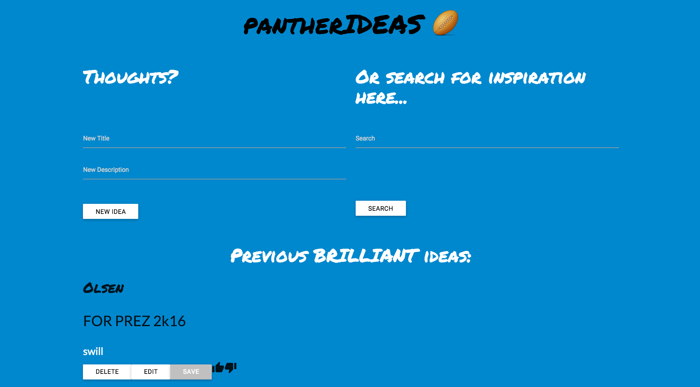

# Ideabox 2.0 Submission Form
[Project Spec](https://github.com/turingschool/curriculum/blob/master/source/projects/revenge_of_idea_box.markdown)

------

# Basics

### Link to the Github Repository for the Project

[Your Repo](https://github.com/jillmd501/IdeaBox-JS)

### Link to the Deployed Application

[Your Application](http://idea-panther.herokuapp.com/)

### Link to Your Commits in the Github Repository for the Project

[Your Commits](https://github.com/jillmd501/IdeaBox-JS/commits/master)

### Provide a Screenshot of your Application

## Completion

### Were you able to complete the base functionality?
HAIL YEAH!
#### If not, list what functionality is missing.

### Which extensions, if any, did you complete?
Sadly, none - next time.

### Attach a .gif, or images of any extensions work being used on the site.

# Code Quality

### Link to a specific block of your code on Github that you are proud of:
[Render](https://github.com/jillmd501/IdeaBox-JS/blob/master/app/assets/javascripts/ideas.js#L14-L27)

#### Why were you proud of this piece of code?

I know it is strange to be proud of a render function, but if you saw what Amber and I did in our Trelora project, you would understand.  I get tripped up easily by spare '' and " ", so being able to comb through the long render function was a real confidence booster when it came to finding errors without having to debug.  While this isn't represented in a single line of code, my debugging skills in JS have skyrocketed because of this project.  I am feeling a lot more confident about having a plan when errors arise and I was able to help out a few people with it as well which is always a nice feeling. :)  I also felt like a spy trying to find the specific error since JS doesn't tell you CRAP.

### Link to a specific block of your code on Github that you feel not great about

[Thumbs Up](https://github.com/jillmd501/IdeaBox-JS/blob/master/app/assets/javascripts/ideas.js#L143-L166)

#### Why do you feel not awesome about the code? What challenges did you face trying to write/refactor it?

I spent about 60% of the project working on thumbs up and thumbs down.  I started by saving the quality types in a variable and really struggled through moving up and down as well as rendering new words on the page.  If/else statements have haunted me since SuperFizzBuzz and I try to stay away from them.  I am hoping to work on refactoring throughout the module to improve on lengthy/verbose code.  I still have the M1 fear of breaking code while refactoring, but have gotten more comfortable as I have learned about rolling back to past commits, heroku deploys, and other methods to stave off the 'FREAK OUT.'

### Attach a screenshot or paste the output from your terminal of the result of your test-suite running.

### Provide a link to an example, if you have one, of a test that covers an 'edge case' or 'unhappy path'

Testing is hard.
-----

### Please feel free to ask any other questions or make any other statements below!

I know it was a snowday, but I struggle with JS testing and would love some more help on that.  I also really enjoyed Steve's lesson yesterday working through specific methods and how to use them.  There is so much out there in the JS land, that I need to slow down and pick out the biggest pieces I want to get out of it.  Also wondering your thoughts on react.js?  Looking for a more front end heavy position and it seems like this is a good move.
