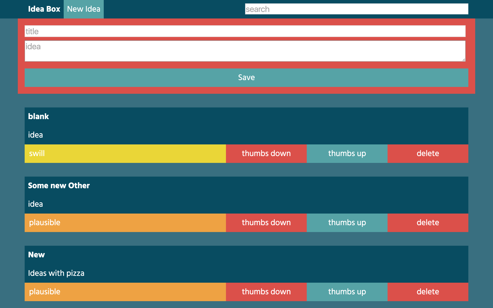

# Sal Ideabox 2.0 Submission
[Project Spec](https://github.com/turingschool/curriculum/blob/master/source/projects/revenge_of_idea_box.markdown)

------

# Basics

### Link to the Github Repository for the Project
[Ideabox](https://github.com/s-espinosa/idea_box)

### Link to the Deployed Application
[s-espinosa-ideabox](http://s-espinosa-ideabox.herokuapp.com/)

### Link to Your Commits in the Github Repository for the Project
[Commits](https://github.com/s-espinosa/idea_box/commits/master)

### Provide a Screenshot of your Application


## Completion

### Were you able to complete the base functionality?
No.

* Ideas limited to 100 characters when displayed.

### Which extensions, if any, did you complete?
None.

### Attach a .gif, or images of any extensions work being used on the site.

# Code Quality

### Link to a specific block of your code on Github that you are proud of
[load.js](https://github.com/s-espinosa/idea_box/blob/master/app/assets/javascripts/load.js)
* To me this code nicely breaks out the high-level process that occurs on page load. I like the way it describes the things that need to happen when a user first visits the site without being cluttered with detail.

### Link to a specific block of your code on Github that you feel not great about
[upgrade_idea.js](https://github.com/s-espinosa/idea_box/blob/master/app/assets/javascripts/upgrade_idea.js)
[downgrade_idea.js](https://github.com/s-espinosa/idea_box/blob/master/app/assets/javascripts/downgrade_idea.js)
* There's a lot of duplication in these two files. They're performing very similar actions, but just moving in opposite directions. Ultimately I found it easier to track what was happening for each of these buttons by having completely separate processes, but I could have removed some duplication by adding the ability to pass a direction (e.g. up/down) at the beginning of the process. It felt like that might be adding some unnecessary complexity around the conditions for switching from swill to plausible to genius, so I didn't pursue that path, but still don't feel entirely happy about it.

### Attach a screenshot or paste the output from your terminal of the result of your test-suite running.
```
When a user adds an idea
  the new idea is displayed

When a user deletes an idea
  the idea is removed from the page and deleted

When a user adds an idea
  the new idea is displayed

When a user rates an idea
  the rating is increased with thumbs up
  the rating is decreased with thumbs down
  the rating is not impacted by invalid ratings

When a user deletes an idea
  the idea is removed from the page and deleted

When a user visits root
  they see a list of ideas

POST /api/v1/ideas
  creates and returns an idea

DELETE /api/v1/ideas/:id
  deletes an idea from the database

GET /api/v1/ideas
  returns a list of all ideas

PATCH /api/v1/ideas
  updates an idea

Finished in 3.31 seconds (files took 2.59 seconds to load)
12 examples, 0 failures

Coverage report generated for RSpec to /Users/sespinos/Documents/web/school/turing/4module/projects/idea_box/coverage. 29 / 29 LOC (100.0%) covered.
```

### Provide a link to an example, if you have one, of a test that covers an 'edge case' or 'unhappy path'

[Rating not impacted by invalid ratings](https://github.com/s-espinosa/idea_box/blob/b4518d4ef187590dde443766f262dc7d480ecb50/spec/features/user_can_rate_ideas_spec.rb#L34-L53)

-----

### Please feel free to ask any other questions or make any other statements below!
