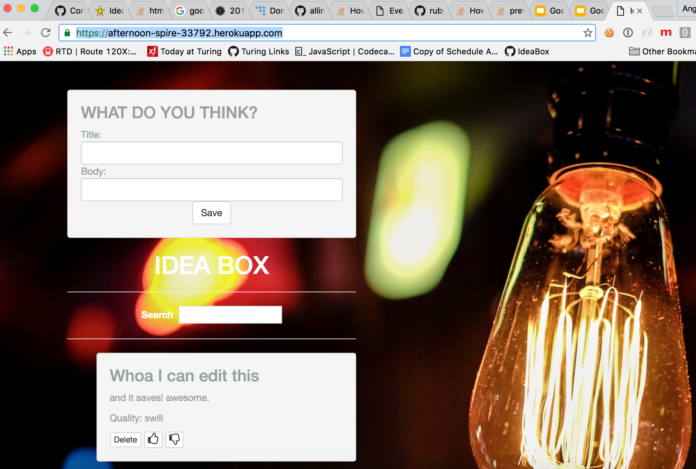

# Ideabox 2.0 Submission Form
[Project Spec](https://github.com/turingschool/curriculum/blob/master/source/projects/revenge_of_idea_box.markdown)

------

# Basics

### Link to the Github Repository for the Project
[My IdeaBox Repo](https://github.com/allindow/idea_box)

### Link to the Deployed Application
[IdeaBox on Heroku](https://afternoon-spire-33792.herokuapp.com/)

### Link to Your Commits in the Github Repository for the Project
[My Commits](https://github.com/allindow/idea_box/commits/master)

### Provide a Screenshot of your Application


## Completion

### Were you able to complete the base functionality?
* Yes

### Which extensions, if any, did you complete?
* None

# Code Quality

### Link to a specific block of your code on Github that you are proud of
* Why were you proud of this piece of code?
 [editIdea](https://github.com/allindow/idea_box/blob/master/app/assets/javascripts/edit_idea.js#L5-L15)

 I'm proud of it because originally this whole JS file was very *not* DRY, and I wasn't going to bother with refactoring it because I felt like there was a lot going on. I decided to try it, and in the process got more practice traversing the DOM. I think the each loops could have been pulled out into separate functions, too, but I'm happy that I got to this point.

### Link to a specific block of your code on Github that you feel not great about
* Why do you feel not awesome about the code? What challenges did you face trying to write/refactor it?
[getIdeas](https://github.com/allindow/idea_box/blob/master/app/assets/javascripts/get_all_ideas.js#L1-L17)

Clearly all of this is commented out. I wouldn't say I don't feel awesome about it because I think the implementation is ok, and it worked when I was in the browser. However, it made a majority of my tests fail because with Selenium, it wasn't getting the ideas to load to the page for some reason. I tinkered around for quite a while but wasn't able to figure it out, so I left in my original code in index.html.erb where I'm iterating through `@items` on the initial page load.

### Attach a screenshot or paste the output from your terminal of the result of your test-suite running.
```
idea_box git/master  11s
❯ rspec
............

Finished in 7.54 seconds (files took 2.55 seconds to load)
12 examples, 0 failures

Coverage report generated for RSpec to /Users/Angela/turing/4module/projects/idea_box/coverage. 30 / 30 LOC (100.0%) covered.
```


### Provide a link to an example, if you have one, of a test that covers an 'edge case' or 'unhappy path'

-----

### Please feel free to ask any other questions or make any other statements below!
* Any ideas on the weird selenium not loading my ideas thing?


## Instructor Evaluation Points

### Specification Adherence

* **10 points**: The application consists of one page with all of the major functionality being provided by jQuery. There is no use of `format.js` in Rails. There is no use of unobstrusive JavaScript. There are no front-end frameworks used in the application. No approach was taken that is counter to the spirit of the project and its learning goals. There are no features missing from above that make the application feel incomplete or hard to use.

### User Interface

* **5 points** - The application is pleasant, logical, and easy to use. There no holes in functionality and the application stands on it own to be used by the instructor _without_ guidance from the developer.

### Testing

* **8 points** - Project has a running test suite that tests and multiple levels but fails to cover some features. All controller actions are covered by tests. The application makes some use of integration testing.

### Ruby and Rails Quality

* **9 points** - Developer is able to craft Rails features that make smart use of Ruby, follow the principles of MVC, and push business logic down where it belongs. There _zero_ instances where an instructor would recommend taking a different approach. Developer writes code that is exceptionally clear and well-factored. Application is expertly divided into logical components each with a clear, single responsibility.

### JavaScript Style

* **8 points** - Application is thoughtfully put together with some duplication and no major bugs. Developer can speak to choices made in the code and knows what every line of code is doing.

### Workflow

* **10 points** - The developer effectively uses Git branches and many small, atomic commits that document the evolution of their application.
