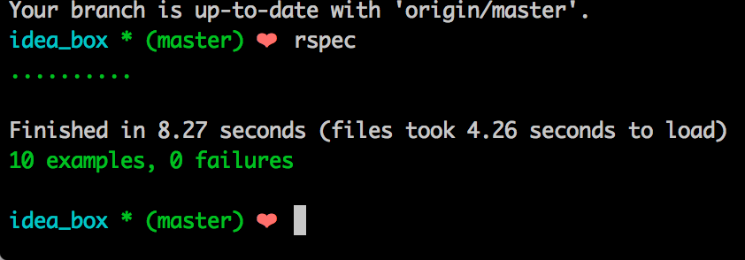

# Basics

### Link to the Github Repository for the Project
[Your Repo](https://github.com/deborahleehamel/idea_box)

### Link to the Deployed Application
[Your Application](http://my-idea-box.herokuapp.com/)

### Link to Your Commits in the Github Repository for the Project
[Your Commits](https://github.com/deborahleehamel/idea_box/commits/master)

### Provide a Screenshot of your Application

## Completion

### Were you able to complete the base functionality?
* If not, list what functionality is missing.
Idea bodies longer than 100 characters should be truncated
Idea Filtering and Searching

### Which extensions, if any, did you complete?

### Attach a .gif, or images of any extensions work being used on the site.

# Code Quality

### Link to a specific block of your code on Github that you are proud of
* Why were you proud of this piece of code?
https://github.com/deborahleehamel/idea_box/blob/master/app/assets/javascripts/ideas.js#L11-L24
This was my first project built out with javascript. My first foray into jQuery, so I was pleased that I got it to work.

### Link to a specific block of your code on Github that you feel not great about
* Why do you feel not awesome about the code? What challenges did you face trying to write/refactor it?
https://github.com/deborahleehamel/idea_box/blob/master/app/assets/javascripts/ideas.js#L63-L79

I was only able to build part of this feature. I tried to use on.('change'), but didn't get there with it and ran out of time.
https://github.com/deborahleehamel/idea_box/blob/more_testing/spec/features/user_can_delete_idea_spec.rb#L10
Not able to get capybara to click on a specific "Delete" button. Tried passing selectors and/or my specific idea.id within, using find and match examples to click on "Delete" button.

### Attach a screenshot or paste the output from your terminal of the result of your test-suite running.

### Provide a link to an example, if you have one, of a test that covers an 'edge case' or 'unhappy path'
https://github.com/deborahleehamel/idea_box/blob/more_testing/spec/models/idea_spec.rb#L10-L23

-----

### Please feel free to ask any other questions or make any other statements below!

* Idea bodies longer than 100 characters should be truncated to the nearest word. (5 points)
*  The user should be able to "commit" their changes by pressing "Enter/Return" or by clicking outside of the text field. (4 points)
* If the user reloads the page, their edits will be reflected. (4 points, mandatory for specification adherence)
* At the top of the idea list, include a text field labeled "Search". (3 points)
* As a user types in the search box, the list of ideas should filter in real time to only display ideas whose title or body include the user's text. The page _should not_ reload. (6 points)
* Clearing the search box should restore all the ideas to the list. (6 points)

## Instructor Evaluation Points

### Specification Adherence

* **10 points**: The application consists of one page with all of the major functionality being provided by jQuery. There is no use of `format.js` in Rails. There is no use of unobstrusive JavaScript. There are no front-end frameworks used in the application. No approach was taken that is counter to the spirit of the project and its learning goals. There are no features missing from above that make the application feel incomplete or hard to use.

### User Interface

* 4 - Edit does not commit to the DB

* **5 points** - The application is pleasant, logical, and easy to use. There no holes in functionality and the application stands on it own to be used by the instructor _without_ guidance from the developer.
* **3 points** - The application has many strong pages/interactions, but a few holes in lesser-used functionality.

### Testing
* 7 - No feature test for Delete - no request test for edit.

* **8 points** - Project has a running test suite that tests and multiple levels but fails to cover some features. All controller actions are covered by tests. The application makes some use of integration testing.
* **5 points** - Project has sporadic use of tests and multiple levels. Not all controller actions are tested. There are little or no attempts at integration testing.

### Ruby and Rails Quality

* 9 - Suggest moving the ordered query to the DB - everything else looks really good

* **10 points** - Developer is able to craft Rails features that make smart use of Ruby, follow the principles of MVC, and push business logic down where it belongs. There _zero_ instances where an instructor would recommend taking a different approach. Developer writes code that is exceptionally clear and well-factored. Application is expertly divided into logical components each with a clear, single responsibility.
* **8 points** - Developer solves problems with a balance between conciseness and clarity and often extracts logical components. Developer can speak to choices made in the code and knows what every line of code is doing.

### JavaScript Style

* 7 - Not really a bug - Can speak to most lines of code, made good choices with ajax.

* **8 points** - Application is thoughtfully put together with some duplication and no major bugs. Developer can speak to choices made in the code and knows what every line of code is doing.
* **5 points** - Your application has some duplication and minor bugs. Developer can speak to most choices made in the code and knows what every line is doing.

### Workflow

* **10 points** - The developer effectively uses Git branches and many small, atomic commits that document the evolution of their application.
